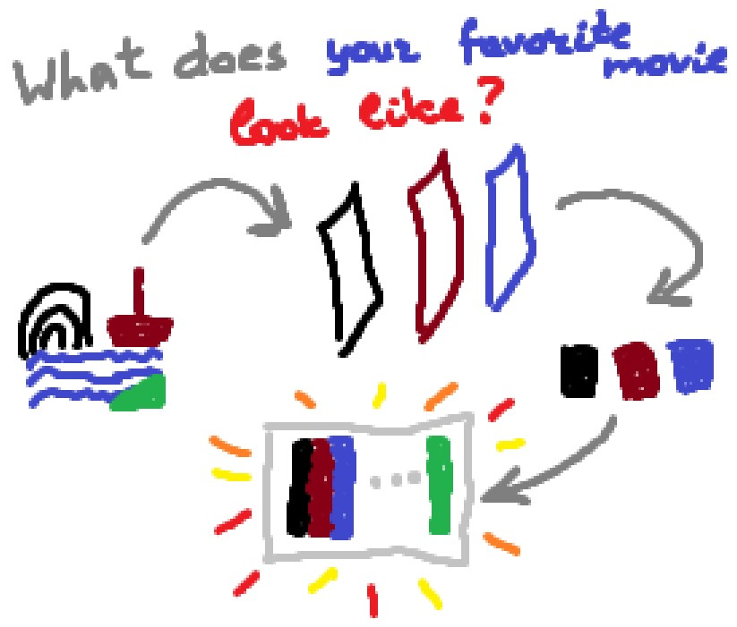

# What Does Your Favorite Movie Look Like?

### How to convert any video into an image that reflects its color scheme.

Creating an image that reflects the color scheme of any video using Python, [moviepy](https://zulko.github.io/moviepy/), [scikit-learn](https://scikit-learn.org/stable/) and [matplotlib](https://matplotlib.org/).

## Tutorial

You can read detailed tutorial on [Towards Data Science](https://towardsdatascience.com/what-does-your-favorite-movie-look-like-8c7b4a13ee94).

## Project Structure

The project contains the following folders:
- The `gallery` folder contains the result images generated by the program based on different movies.
- The `videos` folder must contain videos to be processed.
- The `tmp` folder will store temporary files.

And code files:
- `main.py` script contains the main program;
- `video_color_scheme.py` file contains the functional code wrapped into a class.
- `video_color_scheme_demo.ipynb` notebook contains demo code to analyse the image colors and compose the result image.

## Setup

First, you need to install the required libraries. You can do it with `pip install -r requirements` command.

Now you can run the script using `python main.py <parameters>` command. For example `python main.py --video_path video.mp4 --result_path image.png --width 20 --height 5`.

## The list of program parameters

Required parameters:
- `video_path`: Path to the video file to process;
- `result_path`: Path to save the resulting image (including .png);
- `width`: Width of the resulting image, inches. Default value: 25;
- `height`: Height of the resulting image, inches. Default value: 5.

Less important parameters:
- `mode`: Mode to choose a color. If 'popular' - return the most popular color, else sample a color according to distribution. Default value: 'sample';
- `start`: Time to start video processing (seconds). Default value: 1;
- `step`: Step in seconds. Default value: 1;
- `number_of_colors`: Number of colors to extract from each image (number of clusters). Default value: 5;
- `compress_to`: Number of pixels to resize the image during preprocessing. Default value: 200;
- `verbose`: If True, show the resulting image. Default value: False;
- `delete_after`: If True, delete temporary files after processing. Default value: False.
